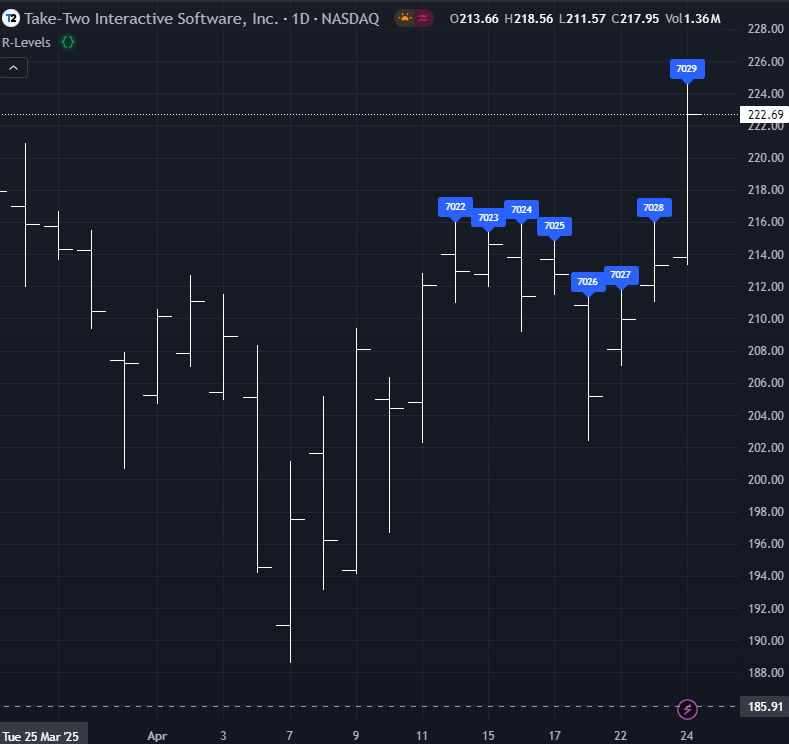
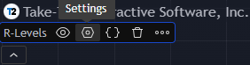
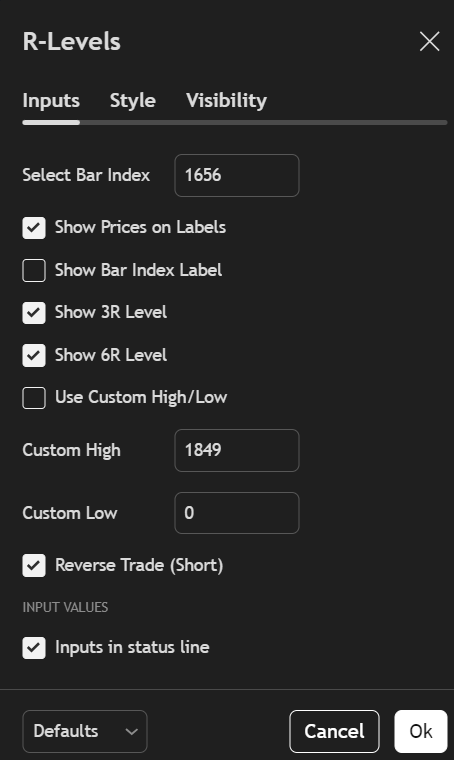
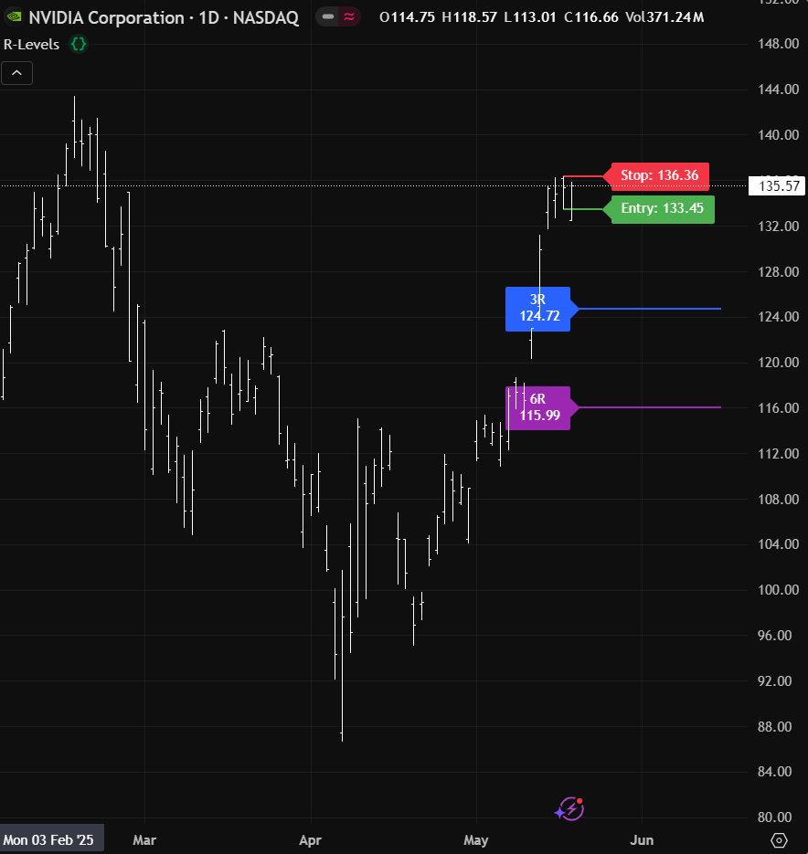

# R-Levels 🔫📈
**R-Levels** is a precision-built TradingView indicator for traders who want to quickly visualize and act on risk-to-reward levels directly on their TradingView charts. 
This Pine Script indicator calculates and displays the 3R and 6R targets based on a selected bar or custom-defined risk (either for Long or Short trade).

**R-Levels** enhances your chart with clear, visualized profit targets — making it an essential addition for both **risk management** and **strategy optimization**.

---

## ✨ Features

- Simple, lightweight Pine Script (v6)
- Automatically plots:
  - ✅ Entry level
  - 🛑 Stop loss level
  - 🎯 3R and 6R target lines
-   Fully customizable via inputs
-   Support for Long and Short Trades:
    -  Toggle between long or short mode to match your trade direction

---

## 📸 Example
Here’s what the R-Levels indicator looks like in action:

* Load the script onto your chart.
* Identify the bar index where you want to enter the trade.

* Open the indicator settings by clicking the gear icon on the indicator name.

* In the settings popup:
  - Enter your selected value into the “Select Bar Index” input field.
  - (Optional) Disable “Show Bar Index Label” for a cleaner chart view.
  - (Optional) Enable “Use Custom High/Low” and manually enter your desired high and low values.
    -  You can enter only one value (High or Low) to override—whichever you leave at 0 will stay as it is from the selected candle at the Bar Index.
  - (Optional) Enable “Reverse Trade (Short)” to switch to a short setup.
    - This flips entry/stop and calculates R-levels downward from the entry.

Click OK to apply the settings and view the calculated R-levels.

* The indicator now will show your:
  - Entry level, Stop loss
  - 3R and 6R targets
  

* 🔄 Reverse Trade (Short Mode)
  - R-levels are calculated downward from entry.
 

---

## 🛠️ How to Use
1. In Tradingview, Open the Pine Script Editor.
2. Copy the contents of candle_r_levels.pine into the editor.
3. Click Add to Chart.
4. In the settings (gear icon), input the bar_index of the candle you want to analyze.
5. You can find this by hovering over the candle and checking the Data Window.

6. The script will draw the following levels based on that candle:
    - ✅ Entry
    - 🛑 Stop Loss
    - 🎯 3R and 6R target levels
7. 🔔 You can also create TradingView alerts on the 3R and 6R lines:
    - Right-click on the 3R or 6R line drawn by the script.
    - Choose "Add Alert on Horizontal Line" or "Create Alert".
    - Customize your alert (e.g. crossing, once per bar close, etc.)
    - This lets you receive a notification when price hits your target!

---

## 📌 Use Cases

- Scalping or intraday setups with precise risk metrics
- Swing traders looking for target alignment

---

## 🤝 Contributing

Suggestions, bug reports, and contributions are welcome! Feel free to fork the repo, create an issue, or submit a pull request.

---