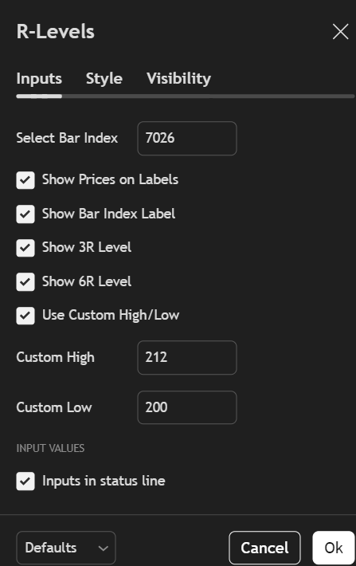
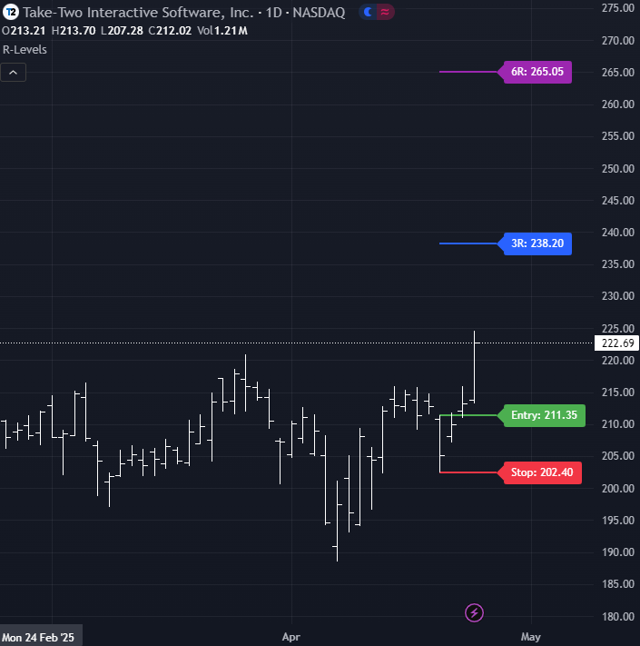

# R-Levels 🔫📈

**R-Levels** is a Pine Script project designed for TradingView that allows traders to visually plan trades based on any candle of their choice. By selecting a specific candle using its `bar_index` .

This is a great tool for **risk-reward visualization**, and **strategy refinement**.

---

## ✨ Features

- Simple, lightweight Pine Script (v6)
- Automatically plots:
  - ✅ Entry level
  - 🛑 Stop loss level
  - 🎯 3R and 6R target lines
- Labels each line for clarity
- Fully customizable via script input

---

## 📷 Quick Start
* Load the script onto your chart.
* Identify the bar index where you want to enter the trade.

* Open the indicator settings by clicking the gear icon on the indicator name.

*In the settings popup:
  - Enter your selected value into the “Select Bar Index” input field.
  - (Optional) Disable “Show Bar Index Label” for a cleaner chart view.
  - (Optional) Enable “Use Custom High/Low” and manually enter your desired high and low values.

Click OK to apply the settings and view the calculated R-levels.

* The indicator now will show your:
  - Entry level, Stop loss
  - 3R and 6R targets
  

---

## 🚀 How to Use

1. Open [TradingView](https://www.tradingview.com/).
2. Open the Pine Script Editor.
3. Copy the contents of `candle_r_levels.pine` into the editor.
4. Add to chart.
5. In the settings (gear icon), input the `bar_index` of the candle you want to analyze.
   - You can find this by hovering over the candle and checking the Data Window.
6. The script will draw Entry, Stop Loss, 3R, and 6R levels based on that candle.

---

